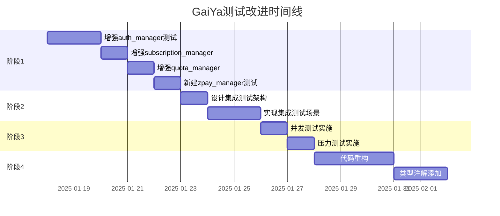

# GaiYa项目测试改进实施计划

> **制定日期**: 2025-01-17
> **当前状态**: 基础单元测试已完成（99测试，16%覆盖率）
> **目标**: 构建全面的测试体系，确保代码质量和系统稳定性

---

## 📊 当前测试覆盖率分析

| 模块 | 当前覆盖率 | 目标覆盖率 | 差距 | 优先级 |
|------|-----------|-----------|------|--------|
| **validators.py** | 99% | 100% | 1% | P3 (已优秀) |
| **auth_manager.py** | 44% | 70% | 26% | **P1** (关键安全) |
| **quota_manager.py** | 54% | 70% | 16% | **P1** (核心业务) |
| **subscription_manager.py** | 41% | 65% | 24% | **P1** (支付关键) |
| **zpay_manager.py** | 0% | 60% | 60% | **P1** (支付核心) |
| **style_manager.py** | 0% | 50% | 50% | P2 (业务功能) |

---

## 🎯 四阶段实施计划

### 阶段1: 提高核心模块覆盖率至60%+ (⏱️ 2-3天)

**目标**: 将业务关键模块的覆盖率提升到60-70%

#### 1.1 增强 auth_manager.py 测试 (44% → 70%)

**需要补充的测试用例** (预计18个新测试):

```python
# 会话管理测试（当前缺失）
- test_refresh_session_success
- test_refresh_session_expired_token
- test_refresh_session_invalid_token
- test_get_current_user_authenticated
- test_get_current_user_anonymous

# 管理员功能测试（当前缺失）
- test_admin_get_user_by_id
- test_admin_list_users_pagination
- test_admin_update_user_metadata

# 边界条件测试
- test_signup_concurrent_same_email
- test_signin_rate_limiting
- test_password_reset_token_expiry
- test_email_verification_multiple_attempts

# 错误恢复测试
- test_database_connection_failure
- test_network_timeout_handling
- test_invalid_json_response

# 安全加固测试
- test_session_hijacking_prevention
- test_csrf_token_validation
- test_password_policy_enforcement
```

**实施步骤**:
1. 运行覆盖率报告，识别未覆盖的函数
2. 为每个未覆盖函数编写至少2个测试用例（正常+异常）
3. 重点测试会话管理和管理员功能
4. 运行测试验证覆盖率提升

**预估时间**: 1.5天
**预期产出**: `tests/unit/test_auth_manager.py` 增加至41个测试（+18）

---

#### 1.2 增强 subscription_manager.py 测试 (41% → 65%)

**需要补充的测试用例** (预计15个新测试):

```python
# 订阅升级/降级测试（当前缺失）
- test_upgrade_from_monthly_to_yearly
- test_downgrade_from_yearly_to_monthly
- test_upgrade_preserves_remaining_days

# 订阅续费测试
- test_auto_renew_before_expiry
- test_manual_renew_after_expiry
- test_renew_with_new_payment_method

# 退款和取消测试
- test_cancel_subscription_immediately
- test_cancel_subscription_at_period_end
- test_refund_calculation_pro_rata

# 订阅状态转换测试
- test_subscription_activation_workflow
- test_subscription_expiration_handling
- test_subscription_suspension_on_payment_failure

# 批量操作测试
- test_batch_expire_subscriptions
- test_get_expiring_subscriptions_in_7_days
- test_subscription_analytics_summary
```

**实施步骤**:
1. 分析subscription_manager的所有公共方法
2. 补充订阅生命周期测试（创建→激活→续费→取消）
3. 添加边界条件和异常处理测试
4. 验证服务端价格强制执行

**预估时间**: 1天
**预期产出**: `tests/unit/test_subscription_manager.py` 增加至36个测试（+15）

---

#### 1.3 增强 quota_manager.py 测试 (54% → 70%)

**需要补充的测试用例** (预计10个新测试):

```python
# 配额消耗测试（当前缺失）
- test_consume_daily_plan_quota
- test_consume_quota_insufficient_balance
- test_consume_quota_atomic_transaction

# 配额重置逻辑测试
- test_weekly_quota_reset_on_monday
- test_monthly_quota_reset_on_first_day
- test_quota_reset_preserves_lifetime_users

# 配额历史记录测试
- test_quota_usage_history_tracking
- test_quota_analytics_by_date_range

# 并发安全测试
- test_concurrent_quota_consumption
- test_race_condition_prevention
```

**预估时间**: 0.5天
**预期产出**: `tests/unit/test_quota_manager.py` 增加至22个测试（+10）

---

#### 1.4 新建 zpay_manager.py 测试 (0% → 60%)

**zpay_manager是支付核心模块，必须有高覆盖率！**

**需要创建的测试用例** (预计25个新测试):

```python
# 支付订单创建测试
- test_create_payment_order_monthly
- test_create_payment_order_yearly
- test_create_payment_order_invalid_plan
- test_payment_amount_server_validation

# 支付回调处理测试
- test_payment_callback_success
- test_payment_callback_signature_verification
- test_payment_callback_duplicate_notification
- test_payment_callback_amount_mismatch

# 支付查询测试
- test_query_payment_status_pending
- test_query_payment_status_success
- test_query_payment_status_failed

# 退款处理测试
- test_initiate_refund_full_amount
- test_initiate_refund_partial_amount
- test_refund_already_refunded

# 安全测试
- test_payment_signature_tampering_detection
- test_payment_replay_attack_prevention
- test_payment_amount_tampering_protection

# 支付对账测试
- test_reconcile_payment_records
- test_detect_missing_callbacks
- test_payment_discrepancy_alert
```

**实施步骤**:
1. 阅读zpay_manager.py源代码，理解支付流程
2. 创建Mock对象模拟支付网关响应
3. 编写完整的支付生命周期测试
4. **重点测试安全性**：签名验证、金额校验、重放攻击

**预估时间**: 1天（支付逻辑复杂，需要仔细测试）
**预期产出**: `tests/unit/test_zpay_manager.py` (新建，25个测试)

---

### 阶段2: 创建集成测试框架 (⏱️ 2天)

**目标**: 测试完整的用户旅程，确保各模块协同工作

#### 2.1 设计集成测试架构

**测试场景设计**:

```python
# 场景1: 新用户注册到首次使用（免费用户）
def test_user_journey_free_user():
    """
    1. 用户注册 → 收到验证邮件
    2. 点击验证链接 → 邮箱验证成功
    3. 登录 → 获取session
    4. 创建任务规划（3次免费配额）
    5. 第4次请求 → 配额不足提示
    """

# 场景2: 付费用户完整流程
def test_user_journey_paid_user():
    """
    1. 免费用户注册并登录
    2. 创建支付订单（月度会员29元）
    3. 模拟支付成功回调
    4. 用户等级升级为pro
    5. 配额自动增加（3次→20次）
    6. 使用AI功能（验证pro权限）
    """

# 场景3: 订阅过期处理
def test_subscription_expiry_handling():
    """
    1. 创建即将过期的订阅（expires_at = now + 1小时）
    2. 用户使用功能（仍可用）
    3. 模拟时间流逝（订阅过期）
    4. 再次使用功能 → 提示订阅已过期
    5. 用户续费 → 功能恢复
    """

# 场景4: 配额重置测试
def test_daily_quota_reset():
    """
    1. 用户消耗所有每日配额（3/3）
    2. 尝试再次使用 → 配额不足
    3. 模拟时间到第二天
    4. 配额自动重置（3/3）
    5. 用户可以继续使用
    """
```

**实施步骤**:
1. 创建 `tests/integration/` 目录
2. 设置测试数据库（使用Docker或SQLite）
3. 编写集成测试基类（setUp/tearDown）
4. 实现上述4个核心场景
5. 配置CI/CD运行集成测试（独立于单元测试）

**预估时间**: 2天
**预期产出**:
- `tests/integration/test_user_journey.py`
- `tests/integration/test_payment_flow.py`
- `tests/integration/test_quota_lifecycle.py`
- `tests/integration/conftest.py` (测试fixtures)

---

### 阶段3: 实施性能测试 (⏱️ 1.5天)

**目标**: 验证系统在高并发场景下的性能表现

#### 3.1 并发测试

**测试工具**: `pytest-xdist` + `locust`

**测试场景**:

```python
# 并发注册测试
def test_concurrent_user_registration(load_test):
    """
    模拟100个用户同时注册
    验证：
    - 数据库事务隔离性
    - 无重复user_id
    - 响应时间 < 2秒
    """

# 并发支付回调测试
def test_concurrent_payment_callbacks(load_test):
    """
    模拟10个支付回调同时到达
    验证：
    - 幂等性（重复回调不重复处理）
    - 数据一致性
    - 无race condition
    """

# 并发配额消耗测试
def test_concurrent_quota_consumption(load_test):
    """
    模拟20个线程同时消耗同一用户配额
    验证：
    - 配额计数准确（无超额消耗）
    - 数据库锁机制有效
    """
```

#### 3.2 压力测试

**使用Locust编写负载测试脚本**:

```python
# locustfile.py
from locust import HttpUser, task, between

class GaiYaUser(HttpUser):
    wait_time = between(1, 3)

    @task(3)
    def check_quota(self):
        self.client.get("/api/quota-status?user_tier=free")

    @task(2)
    def plan_tasks(self):
        self.client.post("/api/plan-tasks", json={
            "user_id": self.user_id,
            "task_description": "Complete project"
        })

    @task(1)
    def check_subscription(self):
        self.client.get(f"/api/subscription-status?user_id={self.user_id}")
```

**性能基准**:
- API响应时间 < 500ms (P95)
- 支持100 QPS（每秒请求数）
- 数据库连接池不耗尽
- 内存使用稳定（无泄漏）

**预估时间**: 1.5天
**预期产出**:
- `tests/performance/test_concurrency.py`
- `tests/performance/locustfile.py`
- 性能测试报告

---

### 阶段4: 代码重构优化 (⏱️ 3-5天)

**目标**: 提高代码可维护性和可测试性

#### 4.1 拆分超大文件

**重构目标**:
- `config_gui.py` (6,955行) → 拆分为多个模块
- `scene_editor.py` (3,155行) → 按功能模块化

**重构方案（以config_gui.py为例）**:

```
gaiya/ui/
├── config_window.py        (主窗口，200行)
├── theme_settings.py       (主题设置，300行)
├── task_settings.py        (任务设置，400行)
├── notification_settings.py(通知设置，200行)
├── membership_ui.py        (会员界面，已存在)
├── scene_settings.py       (场景设置，300行)
└── widgets/
    ├── color_picker.py
    ├── task_table.py
    └── timeline_editor.py
```

**实施步骤**:
1. 使用AST分析代码依赖关系
2. 识别可独立的功能模块
3. 逐个提取模块（保持接口兼容）
4. 运行现有测试验证无破坏性
5. 更新导入路径

**预估时间**: 3天
**风险**: 可能引入回归bug，需谨慎测试

---

#### 4.2 添加类型注解

**目标**: 使用mypy进行静态类型检查

```python
# 示例：为auth_manager添加类型注解
from typing import Dict, Optional, List

class AuthManager:
    def __init__(self) -> None:
        self.client: Optional[Client] = None

    def sign_up_with_email(
        self,
        email: str,
        password: str,
        username: Optional[str] = None
    ) -> Dict[str, any]:
        ...
```

**实施步骤**:
1. 安装mypy: `pip install mypy`
2. 为API模块逐个添加类型注解
3. 运行mypy检查: `mypy api/`
4. 修复类型错误
5. 集成到CI/CD

**预估时间**: 2天
**预期产出**: 所有API模块通过mypy检查

---

## 📅 时间线和里程碑



**总预估时间**: 10-12天（工作日）

---

## ✅ 验收标准

### 阶段1完成标准:
- [ ] auth_manager.py 覆盖率 ≥ 70%
- [ ] subscription_manager.py 覆盖率 ≥ 65%
- [ ] quota_manager.py 覆盖率 ≥ 70%
- [ ] zpay_manager.py 覆盖率 ≥ 60%
- [ ] 整体API模块覆盖率 ≥ 35%
- [ ] 所有测试通过（0失败）

### 阶段2完成标准:
- [ ] 至少4个端到端集成测试场景
- [ ] 集成测试覆盖核心业务流程
- [ ] 测试使用独立测试数据库
- [ ] CI/CD成功运行集成测试

### 阶段3完成标准:
- [ ] 并发测试验证无race condition
- [ ] 压力测试基准达标（100 QPS, P95<500ms）
- [ ] 性能测试报告生成

### 阶段4完成标准:
- [ ] config_gui.py 拆分为≤5个模块
- [ ] 所有API模块通过mypy类型检查
- [ ] 重构后所有测试仍然通过

---

## 🛠️ 所需工具和依赖

```bash
# 测试框架增强
pip install pytest-xdist          # 并发测试
pip install pytest-timeout        # 超时控制
pip install pytest-benchmark      # 性能基准

# 性能测试
pip install locust                # 负载测试
pip install pytest-asyncio        # 异步测试

# 代码质量
pip install mypy                  # 类型检查
pip install black                 # 代码格式化
pip install isort                 # import排序

# 测试数据
pip install faker                 # 生成测试数据
pip install freezegun             # 时间模拟
```

---

## 🚨 风险和缓解措施

| 风险 | 影响 | 概率 | 缓解措施 |
|------|------|------|---------|
| 重构引入回归bug | 高 | 中 | 每次重构后运行全量测试，使用git分支隔离 |
| 测试编写时间超预期 | 中 | 高 | 按优先级分批实施，核心模块优先 |
| CI/CD资源不足 | 低 | 低 | 使用GitHub Actions免费额度，优化测试执行时间 |
| 支付测试数据敏感 | 高 | 中 | 使用Mock数据，禁止使用真实支付信息 |

---

## 📞 实施责任分配

如果团队有多人，建议按模块分工：

- **测试开发负责人**: 统筹整体进度
- **安全测试专员**: 重点负责auth_manager和zpay_manager
- **性能测试专员**: 负责阶段3
- **重构负责人**: 负责阶段4（需熟悉现有代码）

---

## 📊 进度跟踪

**每日站会检查项**:
- [ ] 今日完成的测试用例数
- [ ] 当前模块覆盖率
- [ ] 发现的新bug数量
- [ ] 阻塞问题

**周报内容**:
- 本周覆盖率增长
- 测试发现的关键问题
- 下周计划
- 需要的支持

---

## 🎯 成功指标

**3个月后（全部完成）**:
- ✅ 核心API模块覆盖率 ≥ 60%
- ✅ 0个关键bug逃逸到生产环境
- ✅ CI/CD自动化测试覆盖率 100%
- ✅ 代码可维护性提升30%（模块化后）
- ✅ 系统性能基准达标

---

**立即开始阶段1！** 🚀
