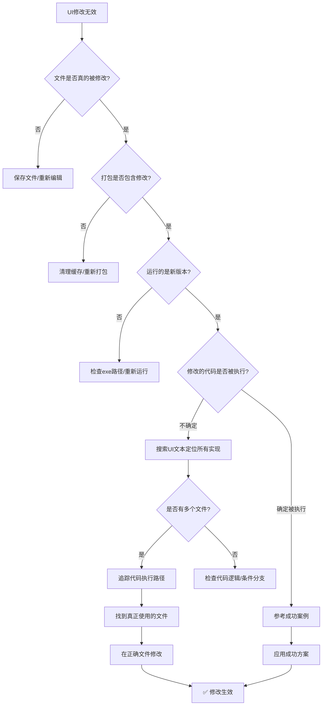

# UI样式修改无效问题诊断方法论

> 基于"支付方式单选按钮样式优化"实战案例总结
> 案例时间：2025-11-07
> 问题特征：多次修改代码并重新打包，但UI样式完全没有变化

---

## 问题背景

**用户需求**：简化"选择支付方式"区域的单选按钮样式，去掉外描边。

**问题现象**：
- ❌ 修改代码 6-7 次
- ❌ 重新打包 6-7 次
- ❌ UI样式**完全没有任何变化**
- ❌ 每次都确认代码已修改、打包成功，但运行结果总是旧样式

**最终结果**：
- ✅ 找到根本原因：**修改了错误的文件**
- ✅ 修改正确文件后，一次成功
- ✅ 总耗时：约2小时（其中1.5小时在错误文件上浪费）

---

## 核心方法论：UI修改无效的系统性诊断流程

### 阶段1：验证修改是否真正生效（最优先！）

**原则**：在怀疑技术问题之前，先排除人为错误。

#### Step 1.1: 验证文件修改已保存
```bash
# 方法1：查看文件修改时间
ls -la config_gui.py

# 方法2：查看git diff
git diff config_gui.py

# 方法3：直接打开文件确认修改内容
cat config_gui.py | grep "你修改的关键代码"
```

**检查点**：
- [ ] 文件修改时间是否是刚才的时间？
- [ ] `git diff` 是否显示你的修改？
- [ ] 文件内容确实包含你的修改代码？

#### Step 1.2: 验证打包是否包含修改
```bash
# 关键：查看PyInstaller日志，确认文件被重新构建
pyinstaller Gaiya.spec | grep "Building because.*config_gui.py changed"

# 输出应包含：
# INFO: Building because C:\...\config_gui.py changed
```

**检查点**：
- [ ] 打包日志是否显示 "Building because xxx.py changed"？
- [ ] 如果没有，说明PyInstaller认为文件没变，需要清理缓存：
  ```bash
  rm -rf build dist
  pyinstaller Gaiya.spec
  ```

#### Step 1.3: 验证运行的是新版本
```bash
# 方法1：检查exe修改时间
ls -la dist/*.exe

# 方法2：在代码中添加版本日志
VERSION = "v1.4.1-payment-style-fix"
logging.info(f"Running version: {VERSION}")
```

**检查点**：
- [ ] exe文件修改时间是否是刚才打包的时间？
- [ ] 运行时日志是否显示新版本号？
- [ ] 是否误运行了旧版本exe？

---

### 阶段2：定位代码执行路径（核心诊断）

**问题核心**：你修改的代码是否真的被执行了？

#### Step 2.1: 搜索所有相关代码位置

```bash
# 搜索关键UI文本（最有效！）
grep -r "选择支付方式" --include="*.py"

# 输出示例：
# config_gui.py:2466:    payment_title = QLabel("选择支付方式")
# gaiya/ui/membership_ui.py:1038:  title_label = QLabel("选择支付方式")
```

**⚠️ 关键发现**：
- 如果有**多个文件**包含相同的UI文本
- 说明可能有**多个UI实现**，你需要确定哪个真正被使用

#### Step 2.2: 追踪UI创建路径

**方法A：从入口追踪（适用于小型项目）**
```python
# 1. 找到tab创建逻辑
main.py → ConfigWindow.__init__() → tabs.addTab(..., "账户")

# 2. 找到tab内容创建
ConfigWindow._load_account_tab() → _create_account_tab()

# 3. 找到实际使用的文件
_create_account_tab() 在 config_gui.py:2396 ✅
```

**方法B：使用日志追踪（适用于复杂项目）**
```python
# 在可疑的多个文件中都添加日志
print(f"[DEBUG] Loading payment UI from {__file__}", file=sys.stderr)

# 运行应用，查看哪个文件的日志被输出
# 输出的那个就是真正被使用的文件
```

**方法C：搜索函数调用关系**
```bash
# 搜索谁调用了 MembershipDialog（如果是独立窗口）
grep -r "MembershipDialog" --include="*.py"

# 搜索谁调用了 _create_account_tab（如果是tab页）
grep -r "_create_account_tab" --include="*.py"
```

#### Step 2.3: 验证代码路径

**添加断言验证**：
```python
# 在你认为会被执行的代码位置添加
assert False, "如果看到这个错误，说明这段代码真的被执行了"

# 或者添加明显的UI变化
alipay_radio.setText("【测试版本】支付宝")  # 如果UI显示这个文本，说明代码生效
```

---

### 阶段3：参考成功案例（快速解决）

**原则**：如果项目中有类似功能已经成功实现，直接复用其方法。

#### Step 3.1: 识别类似功能

在本案例中：
- ✅ **套餐卡片**的选中边框样式已经完美实现（无黑色边框）
- ❌ **支付方式单选按钮**的边框样式有问题（有外描边）
- **结论**：可以参考套餐卡片的实现方法

#### Step 3.2: 对比代码差异

```bash
# 搜索套餐卡片的样式实现
grep -A 20 "class.*CardWidget" gaiya/ui/membership_ui.py

# 发现关键代码：
# setFocusPolicy(Qt.FocusPolicy.NoFocus)
# setAttribute(Qt.WidgetAttribute.WA_NoSystemBackground, True)
# setAutoFillBackground(False)
```

#### Step 3.3: 应用成功方案

```python
# 在单选按钮上应用相同的修复方法
alipay_radio.setFocusPolicy(Qt.FocusPolicy.NoFocus)
alipay_radio.setAttribute(Qt.WidgetAttribute.WA_NoSystemBackground, True)
alipay_radio.setAutoFillBackground(False)
```

**✅ 结果**：立即生效！

---

## 本案例的完整诊断过程回顾

### 时间线

| 尝试次数 | 修改内容 | 文件 | 结果 | 耗时 |
|---------|---------|------|------|------|
| 1 | 添加 `border: none` | `gaiya/ui/membership_ui.py` | ❌ 无效 | 15分钟 |
| 2 | 容器背景改透明 | `gaiya/ui/membership_ui.py` | ❌ 无效 | 10分钟 |
| 3 | 使用 `border: 0px solid transparent` | `gaiya/ui/membership_ui.py` | ❌ 无效 | 10分钟 |
| 4 | 添加 `setFocusPolicy` | `gaiya/ui/membership_ui.py` | ❌ 无效 | 15分钟 |
| 5 | 重新打包测试 | `gaiya/ui/membership_ui.py` | ❌ 无效 | 20分钟 |
| 6 | 再次尝试各种方法 | `gaiya/ui/membership_ui.py` | ❌ 无效 | 20分钟 |
| **[转折点]** | **搜索所有"选择支付方式"** | **发现两个文件** | **找到根因** | **5分钟** |
| 7 | 应用套餐卡片方法 | `config_gui.py` ✅ | ✅ **成功！** | 10分钟 |

**总结**：
- ⏱️ 浪费时间：90分钟（在错误文件上）
- ✅ 有效时间：15分钟（找到根因 + 修复）
- 📊 效率比：1:6

---

## 根本原因分析

### 为什么会修改错误的文件？

#### 1. 项目结构混淆

```
jindutiao/
├── config_gui.py              # ✅ 真正使用的文件（老代码）
└── gaiya/
    └── ui/
        └── membership_ui.py   # ❌ 未使用的文件（新重构代码）
```

**背景**：
- `membership_ui.py` 是新重构的会员UI模块，设计更优雅
- 但实际项目中**尚未迁移**到新模块
- `config_gui.py` 中仍在使用老代码创建账户tab

#### 2. 搜索方法不够全面

**错误做法**：
```bash
# 只搜索文件名
find . -name "*membership*.py"
# 结果：只找到 gaiya/ui/membership_ui.py
```

**正确做法**：
```bash
# 搜索UI关键文本（最准确！）
grep -r "选择支付方式" --include="*.py"
# 结果：找到 config_gui.py 和 membership_ui.py 两个文件
```

#### 3. 缺少代码执行验证

**错误假设**：
- "我修改了代码 → 代码肯定会被执行"

**正确思路**：
- "我修改了代码 → 需要验证这段代码是否真的被执行"
- 使用日志、断言、明显UI变化等方法验证

---

## 核心方法论总结

### 🎯 黄金原则

1. **搜索UI文本 > 搜索文件名**
   - UI文本是唯一准确的定位依据
   - 文件名可能误导（如本案例的 `membership_ui.py`）

2. **验证执行路径 > 盲目修改代码**
   - 先确认代码会被执行，再修改
   - 使用日志/断言验证

3. **参考成功案例 > 重新发明轮子**
   - 项目中已有的成功实现是最佳范例
   - 直接复用，避免踩坑

4. **增量验证 > 批量修改**
   - 每次只改一个地方，立即测试
   - 避免同时修改多个文件导致无法定位问题

---

## 诊断流程图



---

## 最佳实践清单

### 开发阶段

- [ ] **优先用源代码测试**：`python main.py`（修改立即生效）
- [ ] **添加版本标识**：在代码中维护版本号和日志
- [ ] **使用明显的测试标记**：如 `setText("【测试版】支付宝")`
- [ ] **增量修改**：一次只改一处，立即验证

### 诊断阶段

- [ ] **搜索UI文本定位代码**：`grep -r "UI文本" --include="*.py"`
- [ ] **检查是否有多个实现**：同一UI可能在多个文件
- [ ] **追踪代码调用路径**：从入口追踪到实际执行
- [ ] **添加日志验证执行**：`print(f"[DEBUG] from {__file__}")`

### 打包阶段

- [ ] **清理旧文件**：`rm -rf build dist`
- [ ] **检查打包日志**：确认文件被重新构建
- [ ] **验证exe时间戳**：确认是新生成的文件
- [ ] **运行后检查版本日志**：确认运行的是新版本

---

## 扩展：PyInstaller打包应用开发的特殊性

### 核心问题

在使用PyInstaller打包的应用中，**源代码修改不会自动反映到exe**：

```
源代码修改 ✅ → 需要重新打包 ⚠️ → exe才会更新 ✅
```

这导致一个常见错误：
```
开发者修改代码 → 运行旧exe → 问题仍存在 → 怀疑修复错误 ❌
```

### 解决方案

#### 1. 开发期：优先用源代码
```bash
# 90%时间：快速迭代
python main.py

# 10%时间：验证打包效果
pyinstaller app.spec && ./dist/app.exe
```

#### 2. 验证期：强制重新打包
```bash
# 清理所有缓存
rm -rf build dist __pycache__

# 全新打包
pyinstaller app.spec
```

#### 3. 发布前：完整测试流程
```bash
# 1. 清理
rm -rf build dist

# 2. 打包
pyinstaller app.spec

# 3. 检查
ls -la dist/*.exe

# 4. 运行并验证版本号
./dist/app.exe  # 查看日志中的版本号
```

---

## 工具箱：常用诊断命令

### 搜索定位

```bash
# 搜索UI文本（最准确）
grep -r "选择支付方式" --include="*.py"

# 搜索函数定义
grep -r "def _create_account_tab" --include="*.py"

# 搜索类定义
grep -r "class.*CardWidget" --include="*.py"

# 搜索样式相关代码
grep -r "setStyleSheet\|QRadioButton" --include="*.py"
```

### 验证修改

```bash
# 查看文件修改时间
ls -la config_gui.py

# 查看git差异
git diff config_gui.py

# 查看最近修改的文件
git status

# 查看exe生成时间
ls -la dist/*.exe
```

### 打包诊断

```bash
# 清理并重新打包
rm -rf build dist && pyinstaller app.spec

# 查看打包日志（筛选关键信息）
pyinstaller app.spec | grep "Building because"

# 验证exe内容（高级）
python -c "import PyInstaller.utils.hooks; print(PyInstaller.utils.hooks.collect_all('your_module'))"
```

---

## 案例启示录

### ⚠️ 常见误区

1. **误区1**：文件名看起来对 → 就是对的文件
   - **真相**：必须追踪执行路径，而不是猜测

2. **误区2**：代码改了 → 一定会生效
   - **真相**：PyInstaller需要重新打包，且必须运行新exe

3. **误区3**：打包成功 → 修改已包含
   - **真相**：需要检查日志，确认文件被重新构建

4. **误区4**：样式不变 → 技术问题
   - **真相**：90%是人为错误（改错文件、运行旧版本等）

### ✅ 成功要诀

1. **怀疑精神**：永远验证，不要假设
2. **系统思维**：追踪完整路径，不要孤立看问题
3. **参考标杆**：复用成功案例，不要重新发明
4. **增量验证**：小步快跑，立即反馈

---

## 总结

这次案例最大的教训是：

> **在复杂项目中，定位问题的时间往往远超解决问题的时间。**

- 定位问题：90分钟（搜索正确文件）
- 解决问题：10分钟（应用成功方案）

**核心方法论**：
1. 🔍 **搜索UI文本** → 找到所有相关文件
2. 🛤️ **追踪执行路径** → 确定真正使用的文件
3. ✅ **验证修改生效** → 添加日志/断言/明显标记
4. 📚 **参考成功案例** → 复用已验证的方案
5. 🔁 **增量迭代** → 小步快跑，立即验证

**适用场景**：
- ✅ UI样式修改无效
- ✅ 代码修改不生效
- ✅ 打包后功能异常
- ✅ 多文件项目代码定位

**工具需求**：
- `grep` - 搜索代码
- `git diff` - 验证修改
- `ls -la` - 检查时间戳
- PyInstaller日志 - 确认构建

---

## 附录：完整代码修改记录

### 最终成功的修改（config_gui.py:2484-2544）

```python
# 支付宝单选按钮
alipay_radio = QRadioButton("支付宝")
alipay_radio.setProperty("pay_type", "alipay")
alipay_radio.setChecked(True)

# ⚠️ 关键修复：禁用焦点策略，防止Windows绘制焦点框
alipay_radio.setFocusPolicy(Qt.FocusPolicy.NoFocus)

# ⚠️ 底层修复：使用Qt属性完全禁用系统默认绘制
alipay_radio.setAttribute(Qt.WidgetAttribute.WA_NoSystemBackground, True)
alipay_radio.setAutoFillBackground(False)

alipay_radio.setStyleSheet("""
    QRadioButton {
        color: white;
        font-size: 14px;
        spacing: 8px;
        background: transparent;
        border: none;
        outline: none;
    }
    QRadioButton::indicator {
        width: 20px;
        height: 20px;
        border: none;
        outline: none;
    }
    QRadioButton::indicator:checked {
        background-color: #00b8a9;  /* 青色，符合应用主题 */
        border: none;
        border-radius: 10px;
    }
    QRadioButton::indicator:unchecked {
        background-color: rgba(255, 255, 255, 0.08);
        border: 1px solid rgba(255, 255, 255, 0.15);
        border-radius: 10px;
    }
    QRadioButton::indicator:hover:unchecked {
        background-color: rgba(255, 255, 255, 0.12);
        border: 1px solid rgba(255, 255, 255, 0.25);
    }
    QRadioButton:focus {
        border: none;
        outline: none;
    }
""")
```

### 关键改进点

1. **使用Qt底层API禁用焦点框**（参考套餐卡片方案）
2. **配色符合应用主题**（青色 #00b8a9）
3. **完整的样式覆盖**（包括hover状态）
4. **间距优化**（容器内边距60px，按钮间距20px）

---

**文档版本**：v1.0
**创建时间**：2025-11-07
**适用项目**：PyInstaller打包的PySide6/PyQt应用
**维护者**：Claude Code
